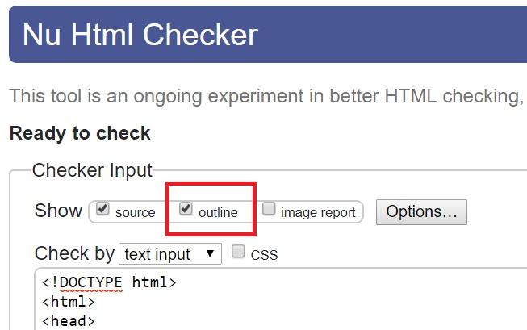
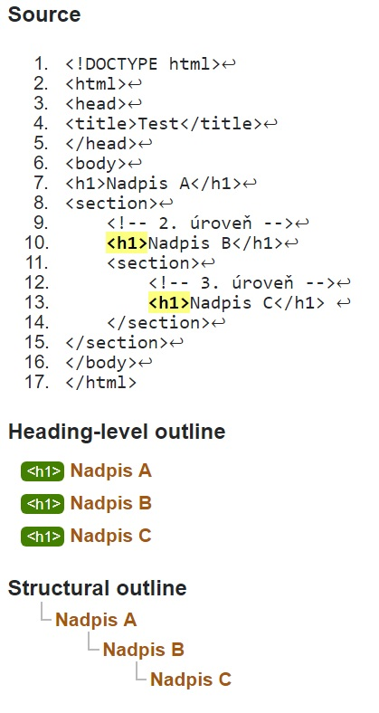

# Cvičenie 2 - HTML5

## Osnova dokumentu
Osnova dokumentu (angl. document outline) je rozvrhnutie/štruktúra dokumentu vytvorená pomocou orientačných bodov (angl. landmarks), akými sú,  napr. nadpisy, názvy formulárov, tabuliek. Klientská aplikácia (angl. user agent, napr. webový prehliadač) môže použiť tieto informácie na vytvorenie obsahu - zoznamu kapitol a podkapitol (angl. TOC - table of contents).

Osnova dokumentu môže vyzerať, napr. takto:

1. Teória pohybových hier
    1. Charakteristika pohybových a športových hier
    2. Systematika pohybových hier
    3. Pohybové hry v telesnej a športovej výchove
        1. Pohybové hry v module zdravie a jeho poruchy
        2. Pohybové hry v module zdravý životný štýl
        3. ...
2. Vyučovanie pohybových hier
    1. Základné okruhy problémov
    2. Plánovanie a príprava na vyučovanie
    3. ...
3. ...

Takýto zoznam môže používateľovi pomôcť ľahšie sa orientovať v štruktúre dokumentu, alebo môže byť analyzovaný syntaktickým analyzátorom (angl. parser), ako napr. webový vyhľadávač, ktorý ho použije na indexovanie dokumentu - za účelom zlepšenia (relevancie) výsledkov vyhľadávania.

**Algoritmus tvorby osnovy HTML5 dokumentu je jasne definovaný v [HTML5 špecifikácii](http://w3c.github.io/html/sections.html#outlines).**

### Osnova dokumentu v HTML4
Vytvorenie osnovy dokumentu v HTML4 je jednoduché. Máme k dispozícii šesť úrovní nadpisov `<h1>` až `<h6>`, kde hlavný nadpis je `<h1>`, podnadpis `<h2>`, atď. 

Napríklad, takáto štruktúra HTML4 dokumentu:
```html
<h1>Teória pohybových hier</h1>
<h2>Charakteristika pohybových a športových hier</h2>
<p>V tejto podkapitole identifikujeme ...</p>
<h2>Systematika pohybových hier</h2>
<p>...</p>
<h2>Pohybové hry v telesnej a športovej výchove</h2>
<p>...</p>
<h3>Pohybové hry v module zdravie a jeho poruchy</h3>
<p>...</p>
```

produkuje takúto osnovu dokumentu:

1. Teória pohybových hier
    1. Charakteristika pohybových a športových hier
    2. Systematika pohybových hier
    3. Pohybové hry v telesnej a športovej výchove
        1. Pohybové hry v module zdravie a jeho poruchy

Nadpisy `<h2>` sú podnadpismi nadpisu `<h1>` a podnadpis *Pohybové hry v telesnej a športovej výchove* má ďalší podnadpis `<h3>`. Je to jednoduché, ale obmedzujúce, lebo musíme dohliadnúť na to, aby úrovne nadpisov reflektovali/boli vhodné pre zamýšľanú štruktúru a musíme si vystačiť so šiestimi úrovňami. 

### Rozdeľujúce elementy v HTML5
Rozdeľujúce elementy `<section>`, `<article>`, `<aside>`, `<nav>` môžu pomôcť vytvoriť lepšiu logickú štruktúru v osnove HTML dokumentu. Prepíšme predchádzajúci príklad tak, že použijeme iba nadpisy úrovne 1:

```html
<h1>Teória pohybových hier</h1>
<h1>Charakteristika pohybových a športových hier</h1>
<p>V tejto podkapitole identifikujeme ...</p>
<h1>Systematika pohybových hier</h1>
<p>...</p>
<h1>Pohybové hry v telesnej a športovej výchove</h1>
<p>...</p>
<h1>Pohybové hry v module zdravie a jeho poruchy</h1>
<p>...</p>
```

Osnova dokumentu bude teraz vyzerať takto:
1. Teória pohybových hier
2. Charakteristika pohybových a športových hier
3. Systematika pohybových hier
4. Pohybové hry v telesnej a športovej výchove
5. Pohybové hry v module zdravie a jeho poruchy

Ako vidíme, toto nie je vôbec dobré, prišli sme o našu štruktúru. S rozdeľujúcimi elementami môžeme vrátiť nášmu dokumentu pôvodnú štruktúru s ponechaním nadpisov prvej úrovne, a to takto:

```html
<h1>Teória pohybových hier</h1>
<section>
    <h1>Charakteristika pohybových a športových hier</h1>
    <p>V tejto podkapitole identifikujeme ...</p>
</section>
<section>
    <h1>Systematika pohybových hier</h1>
    <p>...</p>
</section>
<section>
    <h1>Pohybové hry v telesnej a športovej výchove</h1>
    <p>...</p>
    <section>
        <h1>Pohybové hry v module zdravie a jeho poruchy</h1>
        <p>...</p>
    </section>
</section>
```

Po tejto úprave dostaneme pôvodnú osnovu dokumentu:

1. Teória pohybových hier
    1. Charakteristika pohybových a športových hier
    2. Systematika pohybových hier
    3. Pohybové hry v telesnej a športovej výchove
        1. Pohybové hry v module zdravie a jeho poruchy
        
Prečo? Rozdeľujúce elementy plnia svoju funkciu doslovne - ako naznačuje ich názov - definujú rozdelenie rodičovského elementu do sekcií - každý rozdeľujúci element vytvára novú sekciu. Každá sekcia by mala mať svoj nadpis. Vytvorené sekcie môžeme potom považovať za potomkov, ktorých nadpisy spadajú pod nadpis rodiča, bez ohľadu na úroveň nadpisu. 

Ilustrujme si to na tomto príklade: 

```html
<h2>Teória pohybových hier</h2>
<article>
    <h1>Charakteristika pohybových a športových hier</h1>
    <p>V tejto podkapitole identifikujeme ...</p>
</article>
<article>
    <h1>Systematika pohybových hier</h1>
    <p>...</p>
</article>
```

Napriek tomu, že elementy `<article>` obsahujú element `<h1>`, dostaneme túto osnovu:

1. Teória pohybových hier
    1. Charakteristika pohybových a športových hier
    2. Systematika pohybových hier

Vo vyššie uvedenom príklade sa nachádzajú samé nadpisy `<h1>`, ale na úrovni nadpisov tak nezáleží. Kludne sme si mohli hodiť kockou a použiť nadpisy  `<h2>`, pričom osnova by bola rovnaká. Je to z dôvodu, že rozdeľujúce elementy vytvárajú nové sekcie (oblasti) - celé je to o tom, aké vnorenie sekcií vytvoríme - tie určujú základ pre osnovu dokumentu. Túto koncepciu označujeme ako **explicitné rozdeľovanie**.
  
V uvedenom príklade som bol ľahkovážny. Samozrejme, úrovne nadpisov by sme mali používať hierarchicky, aby bola zachovaná spätná kompatibilita a uľahčili sme ich štýlovanie. Účelom bolo ráznejšie ilustrovať postavenie sekcií.

### Implicitné sekcie
Vzhľadom na to, že rozdeľujúce elementy jazyka HTML5 nie sú povinné na definovanie osnovy dokumentu, existuje spôsob ako definovať sekcie bez nich (na zachovanie kompatibility s existujúcim webom, na ktorom dominujú HTML dokumenty bez rozdeľujúcich elementov).

Nadpisy `<h1>` až `<h6>` definujú novú implicitnú sekciu, ak nie sú prvým nadpisom ich rodiča explicitnej sekcie. Umiestnenie implicitnej sekcie v osnove je určené podľa jej úrovne nadpisu a úrovne predchádzajúceho nadpisu. 

Ak je úroveň nadpisu nižšia, ako úroveň predchádzajúceho nadpisu, potom je v aktuálnej (implicitnej) sekcii vytvorená nová implicitná podsekcia:

```html
<section>
  <h1>Slon africký</h1>  
  <p>...</p>
  <!-- nasledujúca sekcia je implicitná podsekcia -->
  <h3>Africana capensis</h3>
  <p>Africana capensis je poddruh Slona afrického...</p>
</section>
```

Osnova dokumentu bude takáto:

1. Slon africký
    1. Africana capensis


Ak je úroveň nadpisu rovnaká, ako úroveň predchádzajúceho nadpisu, potom je predchádzajúca (implicitná) sekcia uzatvorená a je vytvorená nová implicitná sekcia (na rovnakej úrovni):

```html
<section>
  <h1>Slon africký</h1>  
  <p>...</p>
  <!-- nasledujúca sekcia je nová implicitná sekcia -->
  <h1>Slon indický</h1>
  <p>...</p>
</section>
```


Osnova dokumentu bude takáto:

1. Slon africký
1. Slon indický


Zhrňme si to na tomto príklade, otváranie sekcií ilustrujem komentármi:

```html
<body>
  
<h1>Nadpis A</h1> 
   
<!-- implicitná sekcia: 2. úroveň -->
<h2>Nadpis B</h2>
   
<!-- implicitná sekcia: 3. úroveň -->
<h3>Nadpis C</h3>  
  
<!-- explicitná sekcia: 2. úroveň 
1. úroveň je "telo dokumentu" -->
<section>
    <!-- 2. úroveň --> 
    <h1>Nadpis D</h1>
    
    <!-- implicitná sekcia: 3. úroveň -->
    <h2>Nadpis E</h2>
    
    <!-- implicitná sekcia: 4. úroveň -->
    <h3>Nadpis F</h3>
    
    <!-- explicitná sekcia: 3. úroveň -->
    <section>
        <!-- 3. úroveň --> 
        <h1>Nadpis G</h1>
    </section>
      
    <!-- implicitná sekcia: 2. úroveň -->
    <h1>Nadpis H</h1>
</section>
<!-- uzatvorenie sekcie -->
  
<!-- implicitná sekcia: 2. úroveň  -->
<h4>Nadpis I</h4>
  
<!-- implicitná sekcia: 3. úroveň  -->
<h6>Nadpis J</h6>
  
</body>
```

Ako bude vyzerať osnova dokumentu?

1. Nadpis A
    1. Nadpis B
		1. Nadpis C
	2. Nadpis D
		1. Nadpis E
		    1. Nadpis F
        1. Nadpis G
    1. Nadpis H
    1. Nadpis I
        1. Nadpis J

Toto nie je zrovna osnova, ktorú by sme očakávali rýchlym pohľadom na danú štruktúru HTML dokumentu. Aby bola osnova zrozumiteľná aj ľuďom, je dobré nemiešať "hrušky s jablkami" a určiť sekcie explicitne. 

<a name="spravna-osnova"></a>Porovnajte predchádzajúci príklad s nasledujúcim:

```html
<body>
<h1>Nadpis A</h1> 
<section>
    <h2>Nadpis B</h2>
    <section>
        <h3>Nadpis C</h3> 
    </section>
</section>    
<section>
    <h2>Nadpis D</h2>
    <section>
        <h3>Nadpis E</h3> 
        <section>
            <h4>Nadpis F</h4>
        </section>
    </section>
    <section>
        <h3>Nadpis G</h3>
    </section>
</section>
<section>
    <h2>Nadpis H</h2>
</section>
<section>
    <h2>Nadpis I</h2>
    <section>
        <h3>Nadpis J</h3>
    </section>
</section>
</body>
```

## Aktuálna podpora
Nie je to ale iba o tom. explicitné sekcie áno, ale ... ani po niekoľkých rokoch, čo bola špecifikácia HTML5 uvedená ako odporúčanie, nie je v prehliadačoch (klientských aplikáciách) implementovaná sémantika osnovy dokumentu. Čo to znamená? 

Uvažujme tento príklad:

```html
<!-- 1. úroveň -->
<h1>Nadpis A</h1>
<section>
    <!-- 2. úroveň -->
    <h1>Nadpis B</h1>
    <section>
        <!-- 3. úroveň -->
        <h1>Nadpis C</h1> 
    </section>
</section>
```

Osnova dokumentu je takáto:
1. Nadpis A
    1. Nadpis B
		1. Nadpis C
		
Klientské aplikácie - prehliadače - **v súčasnosti** interpretujú osnovu takto:
1. Nadpis A
2. Nadpis B
3. Nadpis C
	
Je to z dôvodu, že [prehliadače sa držia sémantiky nadpisov](https://www.w3.org/wiki/HTML/Usage/Headings/h1only), a teda dôležitá je úroveň nadpisu (``<h1>`` až ``<h6>``). Keďže k implementácii sémantiky osnovy dosiaľ nedošlo a budúcnosť je otázna, W3C v špecifikácii 5.1 už odporúča, aby vývojári používali (naďalej) nadpisy na vyjadrenie štruktúry v dokumentoch, inými slovami, aby vnorenie sekcií, resp. úrovne nadpisov v sekciách reflektovali hierarchiu ich vnorenia (ako ilustrujem na [predchádzajúcom príklade](#spravna-osnova)).

Prehliadače ako Chrome a Firefox majú definované štýly, ktoré ilustrujú hierarchiu  - [vyskúšajte príklad](http://jsbin.com/ijixib). Aktuálne, ako som písal, okrem štýlov nie je v prehliadačoch implementovaná sémantika osnovy dokumentu. [Vyskúšajte rozšírenie do prehliadača na extrakciu osnovy z HTML stránky](https://chrome.google.com/webstore/detail/html5-outliner/afoibpobokebhgfnknfndkgemglggomo).

[W3C validátor](https://validator.w3.org/nu/) umožňuje zobraziť na výstupe osnovu dokumentu, a to hneď na dvoch úrovniach:
 
 * heading-level outline - z pohľadu sémantiky nadpisov (aktuálna interpretácia osnovy dokumentu prehliadačmi)  
 * structural outline - z pohľadu štruktúry tak, ako ju definuje HTML5 
 
 W3C validátor označenie voľby - zobraziť na výstupe aj osnovu dokumentu:
 
 
     
   
 Ilustrácia osnovy dokumentu ako výstup z W3C validátora:
 
 
 
 

### Ako je to s viacerými nadpismi prvej úrovne v dokumente?
[W3C validátor upozorňuje](https://www.w3.org/wiki/HTML/Usage/Headings/h1only), že v HTML dokumente by mal byť maximálne jeden nadpis prvej úrovne `<h1>` (je unikátny pre celú stránku/dokument).
Na jednej strane ide o rokmi zaužívanú konvenciu komunitou, na strane druhej platí, čo som písal, a teda na vyjadrenie štruktúry HTML dokumentov prehliadače používajú naďalej úroveň nadpisov. [Inžinier z Google hovorí, používajme viacnásobné `<h1>` elementy, ak je na to dôvod](https://www.youtube.com/watch?v=GIn5qJKU8VM). 


### Záver
Vzhľadom na súčasný stav, odporúčam používať úrovne nadpisov na vyjadrenie štruktúry v dokumentoch v kombinácii s rozdeľujúcimi elementami (napr. ``<section>``, ``<article>``) tak, že každá sekcia bude mať svoj nadpis. V dokumente bude jeden nadpis prvej úrovne ``<h1>``. Napríklad:

```html
<body>
<h1>Nadpis A</h1>
<section>
    <h2>Nadpis B</h2>
    <section>
        <h3>Nadpis C</h3>
    </section>
</section>
<section>
    <h2>Nadpis D</h2>
    <section>
        <h3>Nadpis E</h3>
        <section>
            <h4>Nadpis F</h4>
        </section>
    </section>
    <section>
        <h3>Nadpis G</h3>
    </section>
</section>
</body>
```

Prípadne:

```html
<body>
<h1>Nadpis A</h1>
<section>
    <h2>Nadpis B</h2>
    <section>
        <h3>Nadpis C</h3>
    </section>

    <h2>Nadpis D</h2>
    <section>
        <h3>Nadpis E</h3>
        <section>
            <h4>Nadpis F</h4>
        </section>

        <h3>Nadpis G</h3>
    </section>
</section>
</body>
```


## Literatúra
 * [Using HTML sections and outlines](https://developer.mozilla.org/en-US/docs/Web/Guide/HTML/Using_HTML_sections_and_outlines)
 
<a name="c2-priklady"></a>
## Príklady na precvičenie

### Príklad 1
Vytvorte kostru HTML5 dokumentu.

### Príklad 2
Ako vyzerá osnova tohto HTML dokumentu ("zverstva")?

```html
<body>
    <h1>Nadpis A</h1>
    <section>
        <h1>Nadpis B</h1>
    </section>
    <h2>Nadpis C</h2>
    <h3>Nadpis D</h3>
    <section>
        <h5>Nadpis E</h5>
        <h5>Nadpis F</h5>
        <h6>Nadpis G</h6>
        <section>
            <h1>Nadpis H</h1>
        </section>
    </section>
    <section>
        <h1>Nadpis I</h1>
    </section>
</body>
```

### Príklad 3
Vytvorte najskôr v HTML4 a potom v HTML5 takúto osnovu dokumentu:

1. Letné športy a aktivity v prírode
    1. Turistika
        1. História turistiky
        2. Význam turistiky, pohybu a pohybu v prírode
        3. Druhy turistiky
    2. Geocaching a hry s GPS
        1. Charakteristika a história Geocachingu
            1. Pojmy súvisiace s navigačnou hrou Geocaching
        3. Súčasný stav Geocachingu vo svete a na Slovensku
    3. Orientačný beh
        1. Základné pojmy
        2. Orientačné športy
    4. Horská cyklistika
2. Hry v letnej prírode
    1. Charakteristika hier v letnej prírode
    2. Didaktická stránka realizácie hier v letnej prírode


### Príklad 4
Prerobte túto HTML štruktúru do správnej HTML5 štruktúry s použitím nových elementov:

```
<div id="wrapper">
  <header>  
    <h1>Moja super-truper stránka</h1>
  </header>
  <section id="main">
    <!-- page content -->
  </section>
  <section id="secondary">
    <!-- secondary sidebar - related content -->
  </section>
  <footer>
    <!-- footer content -->
  </footer>
</div>
```


### Príklad 5
Uvažujte blog s príspevkami (článkami, angl. blog post). HTML štruktúra mnohých blogov vyzerá aj v súčasnosti, napr. takto:


Inšpirujte sa týmto rozložením stránky (angl. page layout) a vytvorte HTML5 štruktúru s použitím nových elementov.
   
   
 Anatómiu príspevku blogu (post) ilustruje tento obrázok:


