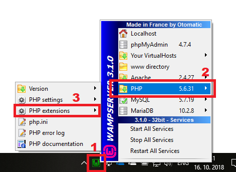
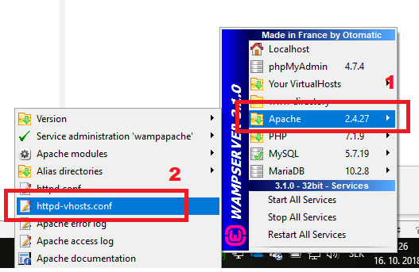
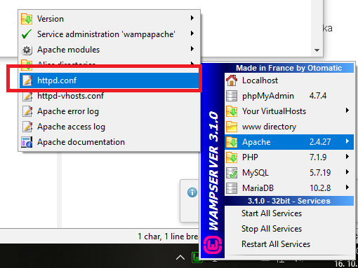

# Cvičenie 5 - Prvý Laravel projekt, rozbehanie vlastného webového server

Na spustenie Laravel aplikácie nie je potrebné rozbehávať vlastný webový server. Postačuje nainštalovať PHP a Composer a použiť zabudovaný webový server. Odporúčam vyskúšať rozbehať si vlastný webový server Apache s konfiguráciou virtuálnych hostov pre aplikácie. Balíček WAMP pre Windows zahŕňa komplet Apache + MySQL + PHP.

## Laravel - zabudovaný web server (php artisan serve) ##

1. Nainštalujte si [PHP](https://www.php.net/downloads) + [Composer](https://getcomposer.org/download/). Po inštalácii nezabudnite zapnúť PHP rozšírenia [potrebné pre Laravel](https://laravel.com/docs/11.x/installation) v súbore `php.ini`:
      * OpenSSL PHP Extension
      * PDO PHP Extension
      * Mbstring PHP Extension
      * Tokenizer PHP Extension
      * XML PHP Extension
      * Ctype PHP Extension
      * JSON PHP Extension
      * BCMath PHP Extension
      * [celý zoznam](https://laravel.com/docs/11.x/deployment#server-requirements)
2. Vytvorte Laravel projekt - postupujte podľa krokov z prednášky, príp. [Laravel Installation](https://laravel.com/docs/11.x/installation)
3. Príkazom `php artisan serve` je možné vytvoriť inštanciu lokálneho webového servera a zároveň spustiť Laravel aplikáciu (musíte byť v priečinku aplikácie). 


## Vlastný webový server s virtual hostami - WAMP ##
   
1. [Nainštalujte si WAMP server](https://www.how2shout.com/how-to/install-wamp-server-windows-10-step-by-step-tutorial-guide.html). Po inštalácii nezabudnite zapnúť PHP rozšírenia [potrebné pre Laravel](https://laravel.com/docs/5.7/installation):
    

2. V koreňovom priečinku `C:\wamp\www` vytvorte priečinok s názvom svojej Laravel aplikácie, napr. `mylaravel`. 

3. V súbore `httpd-vhosts.conf` 

    

    pridajte tieto direktívy:

   ```xml
    <VirtualHost *:80>
        DocumentRoot "c:/wamp/www/mylaravel/public"
        ServerName localhost
        ServerAlias localhost
        <Directory  "c:/wamp/www/mylaravel/public">
            AllowOverride All
            Require local
        </Directory>
    </VirtualHost>
    ``` 
    
    Skontrolujte tiež, či v súbore `httpd.conf` 
    
     
    
    je zapnutý modul `LoadModule rewrite_module modules/mod_rewrite.so`
 
4. Ak beží Váš server na 127.0.0.1, porte 80 a aplikácia je v `C:\wamp\www\mylaravel`, stačí, keď v prehliadači zadáte `127.0.0.1`, resp. localhost - mala by sa spustiť Laravel aplikácia. 

5. V súbore ``C:\Windows\System32\drivers\etc\hosts`` si môžete nastaviť "host names" pre svoje PHP aplikácie - vytvárať tzv. [virtuálne hosty](https://miloserdov.org/?p=1186), napr. pridajte riadok:

    ``127.0.0.1     mylaravel.local``

    a urobte zodpovedajúce zmeny v súbore `httpd-vhosts.conf`:
    
    ```xml
    <VirtualHost *:80>
    DocumentRoot "c:/wamp/www/mylaravel/public"
    ServerName mylaravel.local
    ServerAlias mylaravel.local
    <Directory  "c:/wamp/www/mylaravel/public">
        AllowOverride All
        Require local
    </Directory>
    </VirtualHost>
    ``` 

V prehliadači - v url adrese môžete použiť mylaravel.local. Analogicky si môžete vytvoriť ďalšie virtual hosty pre rôzne PHP (Laravel) aplikácie. 
