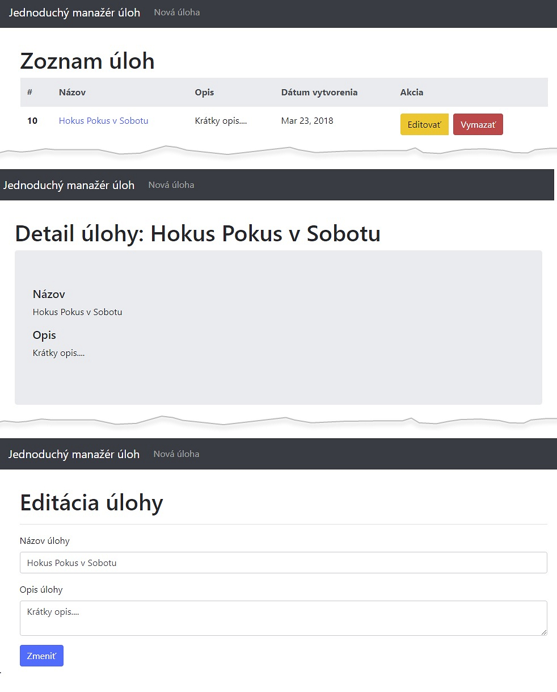
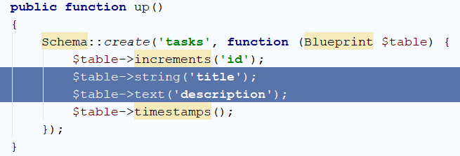
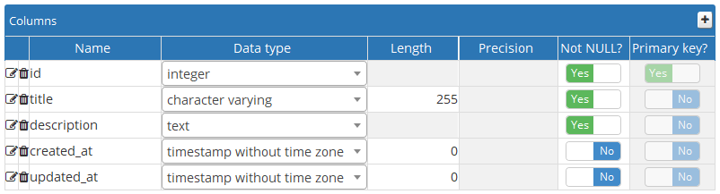
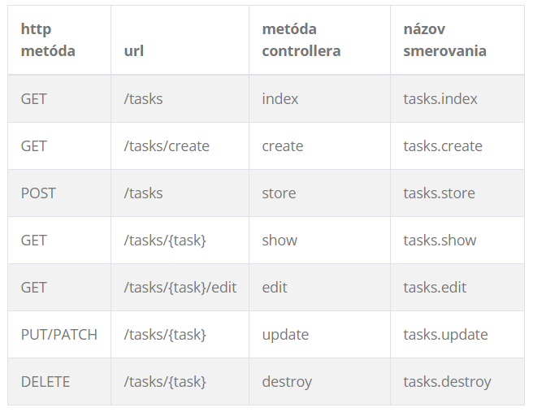

# Laravel tutoriál - jednoduchý manažér úloh

## Cieľ
Vytvoríme jednoduchú aplikáciu na vytváranie, zobrazovanie, editovanie a mazanie úloh ([CRUD](https://en.wikipedia.org/wiki/Create,_read,_update_and_delete)).




## Použijeme tieto základné technológie:

* Laravel 5+
* Bootstrap 4+
* PostgreSQL

## Vytvorenie modelu, migrácie a controller

Vytvorme si novú (čistú) Laravel aplikáciu s názvom *TaskManager* ([postup, ako vytvoriť nový Laravel projekt nájdete v 5. prednáške](/prednasky/zdroje/05-WT-web-ssr-rest-laravel-uvod.pdf). Vytvorme si databázu, napr. s názvom `taskmanager`. V koreňovom priečinku projektu, v súbore `.env`, nastavme pripojenie na databázu:
```
DB_CONNECTION=pgsql
DB_HOST=127.0.0.1
DB_PORT=5432
DB_DATABASE=taskmanager
DB_USERNAME=ekoku
DB_PASSWORD=123456
```
Jednotlivé atribúty, ako napr. meno používateľa (`DB_USERNAME`) a heslo (`DB_PASSWORD`) si nastavíme podľa svojej konfigurácie.

Na otestovanie, či sme úspešne pripojení k databáze, spusťme cez príkazový riadok (ďalej iba CLI, angl. Command LIne) tento príkaz:
```
php artisan migrate
```
V databáze by sa mali vytvoriť predvolené tabuľky, a to `migrations, users, passwords_reset`.

Laravel poskytuje aparát, ktorý umožňuje vytvoriť v jednom kroku model, migračný súbor a controller. K príkazu, ktorým vytvoríme model, pripojíme prepínač `-a`. Vytvorme model s názvom `Task`.

```
php artisan make:model Task -a
```

Po úspešnom vykonaní príkazu, by sa mal: 
* model `Task.php` nachádzať v priečinku `app/`, 
* migračný súbor `*_create_tasks_table.php` by mal byť v priečinku `database/migrations/`,
* a controller `TaskController.php` v priečinku `app > Http > Controllers/`

## Vytvorenie databázovej tabuľky

Otvorme migračný súbor `database/migrations/*_create_tasks_table.php` a pridajme do metódy `up()` tieto riadky:

```php
$table->string('title');
$table->text('description');
```
Týmto sme do modelu pridali dva atribúty - názov úlohy (`title`) a opis (`description`).
 


Nasledujúcim príkazom (cez CLI) vytvoríme v databáze tabuľku s názvom `tasks`:
 
 ```
 php artisan migrate
 ```

V tabuľke sa vytvoria stĺpce, ktoré v metóde `up()` deklarujeme ako atribúty modelu.

 
 
 
## Nastavenie smerovania

V tomto kroku nastavíme smerovanie pre všetky naše predpripravené metódy controllera `TaskController`. Otvorme súbor `app > Http > Controllers/TaskController.php`. Vidíme, že obsahuje niekoľko predpripravených metód, `index`, `create`, `store`, `show`, `edit`, `update`, `destroy`.

Pridaním 
```php
use App\Http\Controllers\TaskController;
```

```php
Route::resource('tasks', TaskController::class);
```
v súbore `routes/web.php` zabezpečíme, aby sa interne automaticky mapovala adresa smerovania na metódu controllera:

 
  
## Layout stránky

V našej aplikácii použijeme Bootstrap. Vytvoríme najskôr layout a následne čiastkové šablóny (partials).

V priečinku `resources/views` vytvorme priečinok `layout`, v ktorom vytvorme súbor `app.blade.php`:

```html
<!doctype html>
<html lang="sk">
<head>
    @include('layout.partials.head')
</head>

<body>
    @include('layout.partials.nav')
  
    <main role="main" class="container">
  
        <div class="taskmanager-template">
            <div class="row">
                <div class="col-sm-12">
                    @yield('content')
                </div>
            </div>
        </div>

    </main>
  
    <!-- Bootstrap core JavaScript -->
    @include('layout.partials.footer-scripts');
</body>
</html>     
``` 

Vidíme, že do layoutu direktívou `@include` vkladáme čiastkové šablóny. V priečinku `resources/views/layout` vytvorme priečinok `partials`, v ktorom postupne vytvorme tieto čiastkové šablóny:

pre hlavičku HTML dokumentu, súbor `head.blade.php`
```html
<meta charset="utf-8">
<meta name="viewport" content="width=device-width, initial-scale=1, shrink-to-fit=no">
<meta name="description" content="">
<meta name="author" content="">

<title>Jednoduchý manažér úloh</title>

<!-- Bootstrap core CSS -->
<link rel="stylesheet" href="https://maxcdn.bootstrapcdn.com/bootstrap/4.0.0-beta.2/css/bootstrap.min.css" integrity="sha384-PsH8R72JQ3SOdhVi3uxftmaW6Vc51MKb0q5P2rRUpPvrszuE4W1povHYgTpBfshb" crossorigin="anonymous">

<!-- Custom styles for this template -->
<link href="{{ asset('css/custom.css') }}" rel="stylesheet">
```

pre navigáciu dokumentu, súbor `nav.blade.php`
```html
<nav class="navbar navbar-expand-md navbar-dark bg-dark">
    <a class="navbar-brand" href="/tasks">Jednoduchý manažér úloh</a>
    <button class="navbar-toggler" type="button" data-toggle="collapse" data-target="#navbarsExampleDefault" aria-controls="navbarsExampleDefault" aria-expanded="false" aria-label="Toggle navigation">
        <span class="navbar-toggler-icon"></span>
    </button>
  
    <div class="collapse navbar-collapse" id="navbarsExampleDefault">
        <ul class="navbar-nav mr-auto">
            <li class="nav-item">
                <a class="nav-link" href="/tasks/create">Nová úloha</a>
            </li>
        </ul>
    </div>
</nav>
```

súbor `footer-scripts.blade.php` pre pätičku dokumentu
```html
<script src="https://code.jquery.com/jquery-3.2.1.slim.min.js" integrity="sha384-KJ3o2DKtIkvYIK3UENzmM7KCkRr/rE9/Qpg6aAZGJwFDMVNA/GpGFF93hXpG5KkN" crossorigin="anonymous"></script>
<script src="https://cdnjs.cloudflare.com/ajax/libs/popper.js/1.12.9/umd/popper.min.js" integrity="sha384-ApNbgh9B+Y1QKtv3Rn7W3mgPxhU9K/ScQsAP7hUibX39j7fakFPskvXusvfa0b4Q" crossorigin="anonymous"></script>
<script src="https://maxcdn.bootstrapcdn.com/bootstrap/4.0.0/js/bootstrap.min.js" integrity="sha384-JZR6Spejh4U02d8jOt6vLEHfe/JQGiRRSQQxSfFWpi1MquVdAyjUar5+76PVCmYl" crossorigin="anonymous"></script>
```

## Vytvorenie metód controllera a zodpovedajúcich šablón

Doplňme telá k predpripraveným metódam controllera.

### Zoznam úloh

Metóda `index` bude vyzerať takto:

```php
public function index()
{
    $tasks = Task::all();
    return view('tasks.index', ['tasks' => $tasks]);
}
```

K nej zodpovedajúca šablóna:

súbor `resources/views/tasks/index.blade.php`

```html
@extends('layout.app')
 
@section('content')
    @if (Session::has('message'))
        <div class="alert alert-info">{{ Session::get('message') }}</div>
    @endif
	<h1>Zoznam úloh</h1>
    <table class="table">
        <thead class="thead-light">
            <tr>
                <th scope="col">#</th>
                <th scope="col">Názov</th>
                <th scope="col">Opis</th>
                <th scope="col">Dátum vytvorenia</th>
                <th scope="col">Akcia</th>
            </tr>
        </thead>
        <tbody>
        @foreach($tasks as $task)
            <tr>
                <th scope="row">{{$task->id}}</th>
                <td><a href="/tasks/{{$task->id}}">{{$task->title}}</a></td>
                <td>{{$task->description}}</td>
                <td>{{$task->created_at->toFormattedDateString()}}</td>
                <td>
                    <div class="btn-group" role="group">
                        <a class="btn btn-warning" href="{{ URL::to('tasks/' . $task->id . '/edit') }}">
                            Editovať
                        </a>&nbsp;&nbsp;
                        <form action="{{url('tasks', [$task->id])}}" method="POST">
                            <input type="hidden" name="_method" value="DELETE">
                            <input type="hidden" name="_token" value="{{ csrf_token() }}">
                            <input type="submit" class="btn btn-danger" value="Vymazať"/>
                        </form>
                    </div>
                </td>
            </tr>
        @endforeach
        </tbody>
    </table>
@endsection
```

### Vytvorenie úlohy

Metóda `create` bude obsahovať:

```php
public function create()
{
    return view('tasks.create');
}
```

K nej zodpovedajúca šablóna:

súbor `resources/views/tasks/create.blade.php`

```html
@extends('layout.app')
 
@section('content')
<h1>Nová úloha</h1>
<hr>
<form action="/tasks" method="post">
    {{ csrf_field() }}
    <div class="form-group">
        <label for="title">Názov úlohy</label>
        <input type="text" class="form-control" id="taskTitle"  name="title">
    </div>
    <div class="form-group">
        <label for="description">Opis úlohy</label>
        <textarea class="form-control" id="taskDescription" name="description"></textarea>
    </div>
    @if ($errors->any())
    <div class="alert alert-danger">
        <ul>
            @foreach ($errors->all() as $error)
            <li>{{ $error }}</li>
            @endforeach
        </ul>
    </div>
    @endif
    <button type="submit" class="btn btn-primary">Vytvoriť</button>
</form>
@endsection
```

`{{csrf_field}}` vytvára vo formulári skryté vstupné pole, ktoré zabraňuje útoku *cross site scripting*. Formulár sme vytvorili klasickým spôsobom - v Laraveli 5.6 nie je [Laravel Collective](https://laravelcollective.com/) priamou súčasťou.

### Uloženie záznamu s úlohou

Metóda `store` bude obsahovať:

```php
public function store(Request $request)
{
    $request->validate([
        'title' => 'required|min:3',
        'description' => 'required',
    ]);
      
    $task = Task::create(['title' => $request->title,'description' => $request->description]);
      
    return redirect('/tasks/'.$task->id);
}
```

Laravel poskytuje metódu validácie - `validate`, ktorá skontroluje hodnoty vstupných polí. Ak hodnoty nespĺňajú uvedené požiadaky, controller odovzdá stránke príslušné chybové správy.

Keď sa teraz pokúsime vložiť nový záznam, dostaneme chybovú správu *Mass Assignment Error*. Je to z dôvodu, že Laravel bráni používateľovi vložiť hodnoty do stĺpcov, ktoré nie sú v modeli deklarované ako `fillable`. Používateľ/útočník by totiž mohol podsunúť aplikácii v požiadavke aj iné polia (atribúty), ktoré si neželáme uložiť. Napríklad, v prípade tabuľky `users` by mohol pri registrácii podsunúť atribút `active` s hodnotou `1`.
 
Do modelu `Task.php` vložme atribút `$fillable`:

`protected $fillable = ['title','description'];`

Pri vytváraní modelu ``Task`` s prepínačom ``-a`` sa nám vytvorili ``form-request`` triedy ``StoreTaskRequest`` a ``UpdateTaskRequest`` v priečinku ``app/Http/Requests``. Ide o triedy požiadaviek, ktoré môžu obsahovať vlastnú logiku overovania a autorizácie. Overovanie uvedené vyššie môžeme presunúť do triedy ``StoreTaskRequest``, konkrétne do metódy ``rules``. Tým si zároveň "vyčistíme" ``controller``. V metóde ``authorize`` je možné definovať komplexnejšiu autorizačnú logiku pre daný model. Vidíme triviálnu definíciu - návratovú hodnotu ``false``. Ak chceme umožniť meniť model neautorizovanému používateľovi, upravme (nateraz jednoducho) návratovú hodnotu na ``true``.
 
### Zobrazenie úlohy

Metóda `show` bude obsahovať:
```php
public function show(Task $task)
{
    return view('tasks.show', ['task' => $task]);
}
```

K nej zodpovedajúca šablóna:

súbor `resources/views/tasks/show.blade.php`
@extends('layout.app')
   
```html
@extends('layout.app')

@section('content')
<h1>Detail úlohy: {{ $task->title }}</h1>
<div class="jumbotron">
	<div class="h5">Názov</div>
    <p>
		{{ $task->title }} 
    </p>
	<div class="h5">Opis</div>
	<p>
		{{ $task->description }}
	</p>
</div>
@endsection
```

### Editovanie úlohy

Metóda `edit` bude obsahovať:
```php
public function edit(Task $task)
{
    return view('tasks.edit', ['task' => $task]);
}
```

K nej zodpovedajúca šablóna:

súbor `resources/views/tasks/edit.blade.php`
@extends('layout.app')
   
```html
@extends('layout.app')
 
@section('content')
<h1>Editácia úlohy</h1>
<hr>
<form action="{{url('tasks', [$task->id])}}" method="POST">
	<input type="hidden" name="_method" value="PUT">
    {{ csrf_field() }}
    <div class="form-group">
        <label for="title">Názov úlohy</label>
        <input type="text" value="{{$task->title}}" class="form-control" id="taskTitle"  name="title" >
    </div>
    <div class="form-group">
        <label for="description">Opis úlohy</label>
        <textarea class="form-control" id="taskDescription" name="description" >{{$task->description}}</textarea>
    </div>
    @if ($errors->any())
    <div class="alert alert-danger">
        <ul>
            @foreach ($errors->all() as $error)
            <li>{{ $error }}</li>
            @endforeach
        </ul>
    </div>
    @endif
    <button type="submit" class="btn btn-primary">Zmeniť</button>
</form>
@endsection
```

### Aktualizácia údajov v modeli

Metóda `update` bude obsahovať:
```php
public function update(Request $request, Task $task)
{
    $request->validate([
        'title' => 'required|min:3',
        'description' => 'required',
    ]);  
         
    $task->title = $request->title;
    $task->description = $request->description;
    $task->save();
    $request->session()->flash('message', 'Úloha bola úspešne zmenená.');
      
    return redirect('tasks');
}
```

Pri zmene údajov v úlohe [by mala byť použitá HTTP metóda PUT](http://restcookbook.com/HTTP%20Methods/put-vs-post/) alebo PATCH. Aktuálne však ani jedna z metód nie je vo formulári podporovaná (ani v HTML5), preto sme museli pridať skryté pole s názvom ` _method` a s hodnotou `PUT`. Napriek tomu, že sme použili vo formulári metódu POST, vďaka skrytému polu bude naša Laravel aplikácia vedieť, že ide o metódu PUT.

Súčasťou HTML5 špecifikácie pre formulár bola pôvodne metóda PUT, avšak bola odstránená. Dôvod? Dávam do pozornosti článok [Why can't forms PUT?](https://rrees.me/tag/put/).

Nezabudnime na metódu ``authorize`` v triede ``UpdateTaskRequest``.

### Vymazanie úlohy

Metóda `destroy` bude obsahovať:

```php
public function destroy(Request $request, Task $task)
{
    $task->delete();
    $request->session()->flash('message', 'Úloha bola úspešne vymazaná.');
    return redirect('tasks');
}
```
Nezabudnime na ``namespace``: ``use Illuminate\Http\Request;``.
Určite ste si všimli, že tlačidlo *Vymazať* je vo formulári, ktorý má - podobne ako pri aktualizácii úlohy - nastavenú metódu POST. Skrytým polom s názvom `_method` indikujeme použitie HTTP metódy `DELETE`.

Hotovo!
